## Relatório de Atividade Avaliativa de SO 15.09.25


## Informações Gerais:  
- título da atividade: S.O. 2025.2 - Atividade 01 - Introdução a linux usando docker no windows
- nome: Lorrany Fagundes Campos da Silva
- data: 10/11/2025

# Introdução

Este relatório tem como objetivo descrever a execução de comandos básicos do Linux e Docker, visando promover familiaridade com esses ambientes.


**Relato**: 
## Atividade 2.2.1 – Iniciar um contêiner Fedora

– instalando o docker

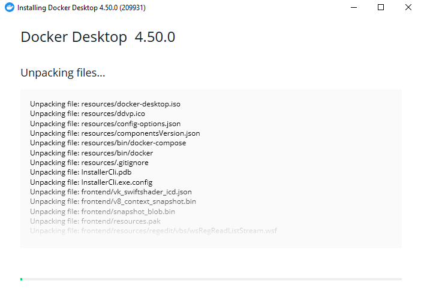

- fiz o update wsl
- executei no powershell o comando 
```
docker run -it --name fedora-tutorial fedora:latest /bin/bash
```
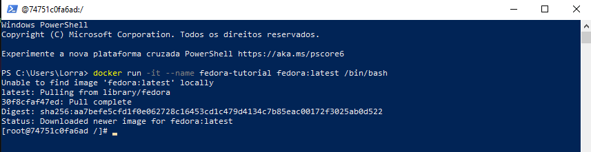


2.2.2. Navegação básica
Verifiquei em qual diretório estou:
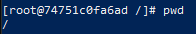

A # significa que estou na raiz.


Usei **cd ~** para acessar a pasta home e, em seguida, ls para listar os arquivos dessa pasta. A pasta estava vazia. Criei uma pasta chamada "atividades", a verifiquei e acessei. Em seguida, saí da pasta - voltei para o diretório anterior.

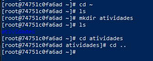

 2.2.3. Manipulação de arquivos

 Acessei o diretório home do usuário e verifiquei que está na home:
 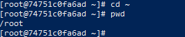

Criei um arquivo arquivo1.txt no diretório home e depois o renomeei para documento.txt:

 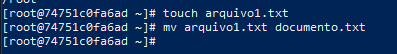

Acessei a pasta atividades e criei um subdiretório chamado backup:
 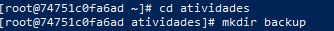

Copiei documento.txt (do home) para backup, verifiquei se o arquivo foi copiado e voltei ao diretório home usando cd ~. Apaguei o documento.txt original (no home) e verifiquei se o arquivo ainda existia em backup:

 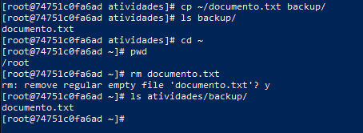

2.2.4. Gerenciamento de pacotes

Atualizei a lista de pacotes com o dnf update:

 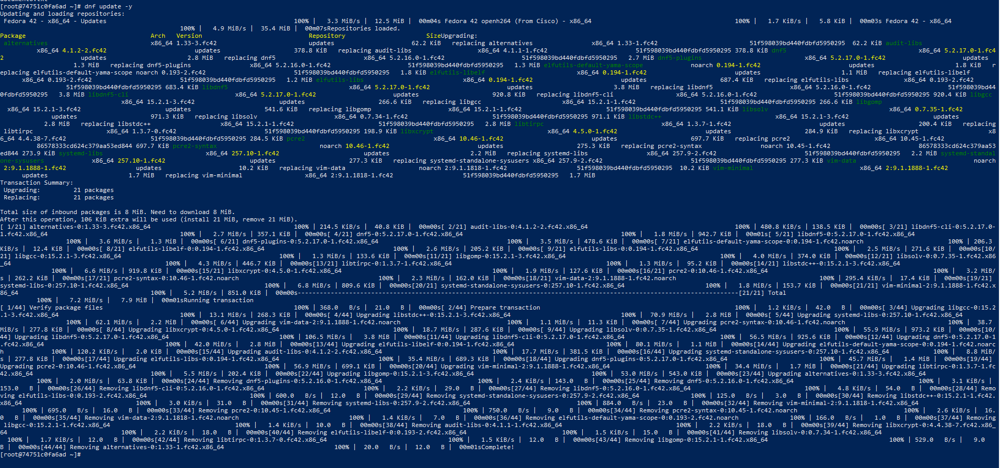


Instalei o editor de texto nano e verifiquei se ele foi instalado:

 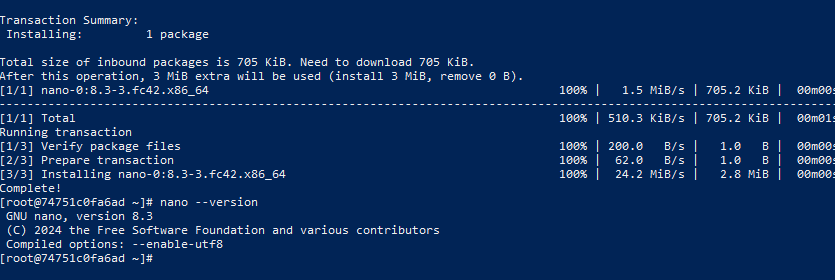


remoção do nano:
 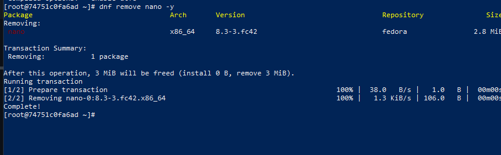

2.2.5. Permissões de arquivos

Criei um arquivo script.sh, dei permissão de execução ao dono e verifiquei as permissões:

 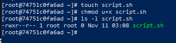

2.2.7. Encerrando o contêiner
Saí do contêiner e o removi após o uso:
 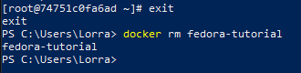


**Conclusão**:
A conclusão desta atividade proporcionou uma valiosa experiência prática que consolidou meu entendimento sobre o uso do terminal Linux e o gerenciamento de ambientes via Docker. A estrutura sequencial do exercício facilitou a execução da maioria dos comandos básicos, que se mostraram claros e acessíveis.

Minha principal dificuldade concentrou-se na seção de gerenciamento de processos e permissões. Especificamente, encontrei um obstáculo na etapa de monitoramento de processos, onde foi necessário instalar pacotes adicionais para que o comando ps estivesse disponível e funcional no contêiner Fedora.

Apesar desses desafios pontuais, a superação deles foi crucial para um aprendizado mais profundo. Considero a atividade extremamente proveitosa e essencial para firmar os conhecimentos iniciais e práticos tanto na linha de comando Linux quanto na manipulação de ambientes isolados com Docker.